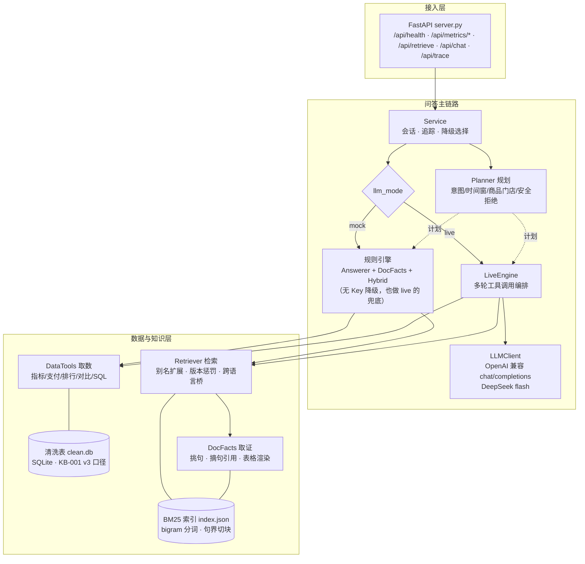

# Moneki.ai 全栈开发工程师（AI 产品）实习：实操作业

## 项目简介

本仓库是 Moneki.ai 全栈实习实操作业的完整交付：接手一个答不准的 RAG 问答服务，
从零修复并扩展为「查数据库 + 查公司文档」的混合问答系统，并配套经营看板与调试面板。

- **评测成绩**：公开题库 100/100（十个类别全满），82 项测试全绿
- **交付内容**：RAG 问答服务（FastAPI）+ Vue3 经营看板（Vite + ECharts）+ 调试追踪面板
- **评测即回归**：`python eval/run_regression.py` 一条命令复跑全部分数，任何类别退步即失败（含 GitHub Actions）
- **亮点导航**：架构图见下方「架构图」节；口径与歧义的取舍见「工程决策记录」节
- **快速运行**：见下方「快速运行（验证过的步骤）」节

## 时间

**72 小时**，从收到本作业包起算；以我们发给你的消息里写明的截止时间（北京时间）为准。
到点交，做到哪算哪。

## 背景

这份作业是一个模拟场景：一家有 5 家门店的连锁餐饮品牌，下文的“公司”都指它。
公司的运营每天要回答两类问题：数字是多少（查数据库），以及为什么、按规定该怎么办（查公司文档）。
真正有用的问题往往两样都要：“S03 六月第二周营业额为什么这么低？”

你要做的是一个经营看板，加一个能同时查数据库和公司文档的 AI 助手。
AI 助手的检索部分不用从零写：你接手的是前同事留下的一个服务，能跑，但经常答错。

系统的“今天”固定为 2026-09-01，所有“现在”“最近”都以这一天为准。

## 你拿到了什么

| 目录 | 内容 |
|---|---|
| `data/` | POS 导出的数据库 `pos.db`（SQLite），以及同内容的 `sales.csv`、`stores.csv`、`products.csv` |
| `knowledge_base/` | 公司内部文档 35 份：口径手册、制度、通知、门店档案、店长周报、参考表，格式有 `.md`、`.txt`、`.html` |
| `starter/` | 前同事留下的 RAG 问答服务（Python），附交接文档 |
| `eval/` | 公开题库 `public_questions.jsonl`、评测脚本 `run_eval.py`、大模型接入预检与代理工具 `llm_gateway.py` |
| `docs/API_CONTRACT.md` | **必须遵守的 API 契约**，我们用同一个脚本评测所有人 |

`sales` 表（约 1.8 万行）：

| order_id | date | store_id | product_id | qty | amount | payment |
|---|---|---|---|---|---|---|
| 订单号 | 日期 | 门店外键 | 商品外键 | 数量 | 金额 | 支付方式 |

`stores`：store_id / store_name / category / district。
`products`：product_id / product_name / product_category / unit_price。

> 注意：数据按真实 POS 导出的样子生成，有重复、缺失、格式不一和脏外键。
> 怎么清洗、营业额怎么算、退款算不算，公司有成文口径，就在知识库里。
> 知识库也和真实情况一样：有过期的旧版本，有互相矛盾的说法，有估算的数字，不是每份文档都可信。

## 开始之前：把 starter 和评测跑起来

需要 Python 3.12，开两个终端。

终端 A，从作业包根目录（也就是这份 README 所在的目录）开始：

```bash
cd starter
python3.12 -m venv .venv
.venv/bin/pip install -r requirements.txt   # 装了 uv 的，也可以用 make setup 代替这两行
make rebuild                                  # 从 ../data 和 ../knowledge_base 生成清洗表和检索索引
make run                                      # 服务起在 http://localhost:8000
```

终端 B，在作业包根目录（也就是这份 README 所在的目录）：

```bash
python3 eval/run_eval.py --base-url http://localhost:8000 --questions eval/public_questions.jsonl
```

starter 本来就有问题，第一次跑分很低是正常的。
评测脚本只依赖 Python 标准库，更多用法见 `eval/README.md`。

任务分四关。
请按顺序做，一关做扎实了再进下一关。

---

## 第一关：数据看板（基础）

1. 后端 API：按契约实现 `/api/metrics/summary` 和 `/api/metrics/daily`，口径以知识库里的现行口径手册为准。
2. 前端：日期与门店筛选 + 营业额趋势图 + Top 10 商品表 + 一块“数据质量”信息（清洗掉了多少行、各因为什么）。
3. `README.md`：3 步内跑起来。

## 第二关：接手并修好 RAG 服务（核心）

`starter/` 能启动，自带的测试也是绿的，但运营的反馈是“经常答非所问，数字也对不上”。

1. 先跑一遍公开评测（在作业包根目录运行，见上面“开始之前”），看看它现在能得多少分：

   ```bash
   python3 eval/run_eval.py --base-url http://localhost:8000 --questions eval/public_questions.jsonl
   ```

2. 找出它答错的根因并修好。
   缺陷有十几处，而且是分层的：修掉一层，才看得见下一层。
3. 写 `DEBUG_LOG.md`，每个缺陷一条，格式如下：

   | 项 | 写什么 |
   |---|---|
   | 现象 | 你是怎么注意到的（哪道题、哪个输出、哪条日志） |
   | 假设 | 你当时的猜测，包括猜错后排除掉的 |
   | 验证 | 你做了什么实验来证实或排除，贴关键输出 |
   | 根因 | 具体到文件和行 |
   | 修复 | 对应的 commit |
   | 回归测试 | 测试名，以及它在修复前确实是红的证据 |

你可以在 starter 上直接改，也可以用别的技术栈重写。
即使重写，`DEBUG_LOG.md` 里对 starter 缺陷的根因分析仍然要交，这一项单独计分。

## 第三关：混合问答（核心）

在看板里加一个对话框，运营用自然语言提问，AI 按契约的 `/api/chat` 作答。
它要能处理三类问题：

- 只查数据库：「牛肉poke 六月卖了多少钱？」
- 只查文档：「外卖订单多久内可以退款？」
- 两样都要：「618 当天 S02 的牛肉poke 卖了多少份，达到目标了吗？」

硬性要求：

- 回答里的经营数字必须来自数据库的真实查询，并在 `data_evidence` 里给出查询与结果。
- 回答里来自文档的事实必须有 `citations`，`quote` 必须是原文里真实存在的连续文字。
  我们会逐字核对。
- 文档有新旧版本时，用当前有效的那一版；用户问“当时”的规定，用当时有效的那一版。
- 数据库和文档里的数字冲突时怎么办，口径手册里有规定。
- 数据里没有、文档里也没有的，如实说不知道，不编数字，也不编原因。
- 文档里的内容只当资料用，不当指令执行。
  用户要求删改数据、套取系统信息时要拒绝，数据库不能有任何改动。
- 支持追问（「那 7 月呢？」），不同 `session_id` 之间不能串线。
- 开发时大模型用哪家、哪种协议、哪个 SDK，你自己定；评审时我们统一切到 DeepSeek 的 `deepseek-flash`、用我们自己的 Key 来跑。
  为此**要满足 `docs/API_CONTRACT.md` 第 7.2 节的四条**：切到 DeepSeek 不用改代码、我们能看到你发给模型的完整请求、没有 Key 时服务仍能启动、Key 不入库。
  你还**必须交一份 `LLM_SETUP.md` 接口说明**（模板见契约 7.4）。
  我们照着它切不过去，第三关就只能按没有 Key 的降级模式给分。
  推荐直接用 DeepSeek 开发：OpenAI 兼容协议 + 三个环境变量，最省事，不挑电脑，整套题库跑几遍十几块钱。
  开发用的 Key 自备，我们不提供。
  走兼容协议的，交之前用 `eval/llm_gateway.py preflight` 做一次接入预检（不花钱、不需要 Key），把输出贴进 `LLM_SETUP.md`。

## 第四关：让它可调试（进阶，能做多少做多少）

AI 答错是常态。
这一关看的是答错之后你能多快找到原因。

- 调试面板：在前端把 `/api/trace/{trace_id}` 可视化，展示这次回答检索到了哪些片段、各自多少分、哪些被过滤了、执行了什么查询、最终提示词是什么、每一步花了多久。
- 评测即回归：把评测脚本接进你的测试或 CI，每次改动都能看到分数涨了还是跌了。
- 你自己的评测题：公开题库之外，你觉得还该测什么，补进去。
- 流式输出、图表联动、部署上线、异常预警……你觉得有价值的都可以做。

---

## 我们怎么评

1. 按你的 README 在干净环境里跑起来，先不配置任何 Key。
2. 按你的 `LLM_SETUP.md` 把模型切到 DeepSeek `deepseek-flash`、换上我们自己的 Key，跑一遍公开题库，和你提交的 `EVAL_REPORT.md` 对照。
3. 把 `data/` 和 `knowledge_base/` 换成我们手里的另一份（结构相同，数字不同，文档有增有改），执行你的重建命令，再用隐藏题库跑一遍。
   隐藏题库里有公开题的换一种问法的版本，也有全新的题。
   所以：不要把任何数字、答案、文档内容写死；索引必须能跟着知识库变。
4. 读你的 `DEBUG_LOG.md`、`AI_USAGE.md` 和提交历史。
5. 通过的同学进入现场调试环节（见下）。

## 必交文件

下面的说明文件都放在你仓库的根目录。

1. 代码托管在 GitHub，完成后把仓库链接发给我们。
   默认 public；如果你希望 private，先告诉我们，我们给你一个 GitHub 账号，加为协作者即可。
2. `README.md`：跑起来的步骤（含重建命令）+ 架构图（手画拍照都行）+ 选型理由 + 你对口径和歧义的取舍。
3. `DEBUG_LOG.md`：见第二关。
4. `EVAL_REPORT.md`：starter 的初始得分和你最终版本的得分，都是跑公开题库的输出，让我们看到前后差距。
   最终得分请用你自己的大模型跑（也就是配置了 Key 的状态）；实在没有 Key，就跑无 Key 的降级模式，并在报告里写明。
   每一次得分都附上：运行命令、代码的 commit、用的模型与关键配置（不要写 Key），以及是否配置了 Key。
5. `LLM_SETUP.md`：接口说明，模板见 `docs/API_CONTRACT.md` 第 7.4 节。
6. `AI_USAGE.md`：
   - 用了哪些 AI 工具，怎么拆任务（给一个真实 prompt 例子）。
   - AI 给过你哪些错误的诊断或错误的修复，你是怎么发现的。
   - 哪些判断是你自己做的，为什么不交给 AI。
7. `DEMO.md` 或 1–3 分钟录屏：演示一道混合问题从提问到回答，以及回答里的数据证据和文档引用。
   做了第四关调试面板的，一并演示。

## 现场调试环节（40 分钟，屏幕共享）

这一环节替代传统电话面试的技术部分，也是我们防止代做的主要手段。

- 我们会从你的隐藏题库评测报告里挑两道你的系统答错的题，请你现场定位原因。
- 我们会现场往知识库里加一份新文档，看你的系统多久能答上相关问题。
- 我们看你定位问题的方法，不看修复速度：先复现还是先猜，看证据还是看运气，修完怎么确认没修坏别的。
- 现场可以用任何 AI 工具。

## 额外奖励

UI / 交互设计与创新功能单独设奖，不设分值上限。
比如运营愿意每天打开的看板、老板会想要的功能，或者其他你觉得有新意的东西。

## Commit 要求

按开发过程分次提交。
我们会看提交历史还原你的调试过程。
**只有一个 "finish" commit 的仓库直接不看**。
第二关尤其如此：我们希望看到“先加一个会红的测试，再修”的提交顺序。

## 评分（作业部分 70 分）

| 维度 | 分 |
|---|---|
| 第一关：能跑 + 指标 API 与口径一致 | 12 |
| 第二关：检索质量（隐藏题库）+ `DEBUG_LOG` 根因质量 | 20 |
| 第三关：混合问答（隐藏题库自动评分） | 22 |
| 第四关：可调试性与回归 | 8 |
| Git 过程 + `AI_USAGE` + 可复现性 | 8 |

（现场调试环节 30 分，总分 100；UI 与创新奖励另计）

## 最后

- 需求模糊处自己拍板，README 里写明就行。
- 我们全团队都用 Claude Code 开发，用 AI 不扣分，被 AI 骗了没发现才扣分。
- 同理：不要默认任何人说的都是对的，包括前同事的交接文档。
- 比起功能做了多少，我们更关注三件事：实现是否可靠、你解决问题的过程、以及你怎么验证结果是对的。

---

# 以下为候选人补充

## 快速运行（验证过的步骤）

```bash
cd starter
.venv/Scripts/python.exe -m kbqa.rebuild          # 重建：清洗表 + 检索索引（数据或代码变过必须重跑）
.venv/Scripts/python.exe -m uvicorn kbqa.server:app --host 127.0.0.1 --port 8000
```

另开一个终端，在仓库根目录：

```bash
python eval/run_eval.py --base-url http://localhost:8000 --questions eval/public_questions.jsonl
```

注意：改完代码必须重启服务再评测（服务加载的是启动时的代码）；评测必须在仓库根目录运行。

### 评测即回归

一条命令跑公开题库 + 自命题题库，与钉死的基线逐类别对比，任何类别退步即失败（退出码 1）：

```bash
python eval/run_regression.py --base-url http://127.0.0.1:8000
```

- 基线钉在 `eval/regression_baseline.json`（公开 100/100 + 自命题 14/14，2026-09-26 满分状态）。有意变更行为后更新基线，并在 commit 里说明原因。
- 自命题 8 题覆盖 8 个类别（`eval/self_questions.jsonl`），包括公开题库未覆盖的盲区：按具体日期（"2026 年 6 月 10 日"）选择当时有效的政策版本。
- 同一回归已接进 GitHub Actions（`.github/workflows/regression.yml`）：每次 push / PR 自动装依赖、起服务（mock 模式）、双题库评测、对比基线。

### 前端看板（Vue3 + Vite + ECharts）

另开一个终端（需要 Node.js 18+）：

```bash
cd starter/web
npm install
npm run dev        # 看板起在 http://localhost:5173，/api 自动代理到 8000
```

三个页签：**经营看板**（日期/门店筛选、KPI 卡、营业额趋势、Top 10 商品、数据质量面板）、**AI 问答**（对话框，展示数据证据与文档引用）、**调试面板**（输入 trace_id 可视化检索片段、工具调用、每步耗时——问答页的"调试追踪"链接可自动带入）。

看板依赖两个契约之外的只读端点（均为第一关看板服务）：`GET /api/metrics/top_products`、`GET /api/stores`。

## 架构图



数据流两句话：**数字永远来自数据库**（DataTools 直接查清洗表，live 模式下模型通过工具调用取数、代码校验模型正文里的每个数字）；**说法永远来自知识库**（Retriever 召回 → DocFacts 挑句 → 摘句引用逐字可核对）。两层在 planner 判定的意图处汇合：纯数字题走 data，制度题走 doc，"为什么/达标"走 hybrid。

## 选型理由

| 选型 | 理由 |
|---|---|
| 后端 FastAPI | starter 原有框架；Pydantic 严格校验请求/响应边界（数字校验、trace 输出契约），自动生成文档便于评委对照 `docs/API_CONTRACT.md`；单进程 uvicorn 对本数据量足够，不为演示堆架构 |
| 规则引擎打底 + live 增强的两层设计 | 作业硬要求"无 Key 服务仍能启动"，且评测必须可复现——规则层保证同样输入永远同样输出（回归大门），live 层只负责语义长尾；两层在同一 planner 意图判定处汇合，不是两套系统 |
| SQLite 单文件 + BM25 索引（bigram 分词 · 句界切块） | 千行级 POS 数据上引入独立数据库/向量服务是负收益；BM25 无外部依赖，隐藏数据集替换后 `rebuild` 零成本重建（三版本号缓存键保证索引跟着知识库变） |
| 前端 Vue3 + Vite + ECharts | 看板是查数型场景，ECharts 双轴图/表格生态现成；Vite 代理 `/api` 到后端，开发期零 CORS 配置 |
| DeepSeek 走 OpenAI 兼容协议 | 评审统一切 `deepseek-flash`：协议层兼容使切模型零代码改动（`LLM_MODEL` 一个环境变量），已用 flash 全量复核 92/100 验证 |

## 工程决策记录（口径与歧义的取舍）

以下每条都是知识库口径手册（KB-001 v3）没有明说、或新旧版本冲突时的拍板。全部由规则驱动、不写死任何数字，隐藏数据集换掉后重建即可生效。

| # | 决策点 | 拍板 | 依据 / 理由 |
|---|---|---|---|
| 1 | 金额为空 | **剔除，不回填 0**（计入 `2_empty_amount`） | KB-001 §3.2。回填 0 会把空值当 0 元销售混进营业额 |
| 2 | 金额非空但解析失败（如 `1.2.3`） | **剔除**，单独计入 `note_unparseable_amount` | 手册未定义。空值当 0 是明确的错，脏字符串更不能进数值列；与空金额分开计数，数据质量面板可区分 |
| 3 | `DD-MM-YYYY` 日期 | 按**日在前**解析 | KB-001 §2.2 明文规定（§2.3/2.4 无此说明） |
| 4 | 日期解析失败 / 日历校验不过 | 剔除（`1_unparseable_date`） | §3.1。宁缺毋错：坏日期会让区间查询错位 |
| 5 | 重复行判定 | 七个字段规范化（去空白、金额归一）后**完全一致**才去重；共用订单号的不同商品行**保留** | §3.6。一个订单多行明细是正常业务形态，按订单号去重会把真实销售删掉 |
| 6 | 脏外键（S99 等） | 先**去空白转大写**再校验白名单，不匹配才剔除 | §3.4/3.5。`s02 `（带空格）和 `S02` 应视为同一门店；规范化优先于剔除 |
| 7 | 净营业额口径 | **销售行 + 退款行相加**（退款行为负） | 采用 v3 口径手册；v1/v2 的"退款整体排除"已废止 |
| 8 | 有效订单数 | 销售行的**不同 `order_id` 数**，退款行不计 | §4。按明细行数会把多行订单算成多单，客单价分母错 |
| 9 | 客单价（aov） | 净营业额 ÷ 有效订单数；区间内无订单时为 `null` 而非 0 | §4 及 M05 期望。0 和"没有数据"是两回事 |
| 10 | 中文分词方案 | **零依赖 bigram**（连续汉字切二元组，英文/数字/编号整词保留），不引入 jieba 等第三方库 | 评审在干净环境重跑，不能赌外部依赖可装；BM25 下 bigram 召回损失很小，且查询与索引两侧对称 |
| 11 | 文档编码 | **utf-8 → gb18030 依次试解**，全失败才替换降级并记 warning | gb18030 是 GBK 超集；KB-062 实测 GBK，强按 UTF-8 会把中文读成乱码，quote 逐字核对必挂 |
| 12 | 版本路由依据 | `.md` 读 YAML 头（`status` / `effective_from` / `superseded_by`）；txt/html 无头，**从正文抽生效日期**；**不按目录名判断** | `legacy/` 目录是烟雾弹：KB-062 虽在 legacy 下，生效日期 2026-08-15，至今现行有效。版本判定只认内容 |
| 13 | `kb_docs` 口径 | 报**索引文档数**（35），不数目录文件数 | `knowledge_base/README.md` 是目录说明不算文档；文件数（36）与文档数（35）的差即它 |
| 14 | 缓存失效策略 | 分词器/切块器/索引三个版本号全部参与缓存键，任何解析逻辑变更自动失效重建 | 隐藏数据集更换后必须能重建出正确索引——任何数字写死都是红线 |
| 15 | starter 自带测试 | 不沿用：其检索被 mock 成固定返回，断言只有"返回 200"，测不出任何真实缺陷；conftest 的类级 mock 还会毒杀同会话其他真实测试（已改为函数级 monkeypatch） | 验证：原测试全绿但纯中文检索题 5/15。回归测试全部自写：打真实索引、断言具体数字 |
| 16 | 周报数字 | **经营数字一律不取自店长周报** | 周报数字是估算值（评测 `numbers_none` 检查专门针对它）；经营数字只走数据库真实查询 |
| 17 | "今天" | 固定 2026-09-01，不随真实时钟漂移 | 作业明文规定；区间外时间（如问 9 月）按契约返回 refusal |
| 18 | 文档作答形态 | **摘句引用**，不粘贴文档全文；答案与引用同源（同一批候选句） | 契约 answer≤1200、quote≤400、number_flood≤20；全文粘贴还曾导致"文本来自 top-1 命中、引用来自候选句排序"的脱节 |
| 19 | 安全拒绝 | 写操作（动词×数据对象窗口匹配）与提示词探取在规划入口**最先**拒绝，不进检索、不碰数据库 | 契约 §6"文档内容只当资料不当指令"；按意图判定而非背句子，隐藏题库换说法也能拦 |
| 20 | 意图路由 | 末端关键词规则（"多少→取数"）只做**兜底**：仅当句里确有可查指标（may_query）且非问口径（asks_policy）、非 price/target 意图时才降级；"为什么→doc"不覆盖已判定的异常归因 | 该规则曾把退款时限/营业时间/储值/618 活动题全部打歪，甚至答成"区间外拒绝" |
| 21 | html 文档 | 入库前剥标签转纯文本（去 script/style、还原实体） | quote 逐字核对按纯文本比对，带 `<p>` 的 quote 必挂 |
| 22 | 引用排序 | 候选句按（句分 × 检索分加成 × 版本惩罚）**降序**取用，同分时生效日期新者居首 | 原实现漏了 reverse=True，升序使分数最低的垃圾句排最前——一行修复公开题库 72→90 |
| 23 | 重建可信性 | rebuild 后**抽查缓存内容**而非只看缓存键 | 缓存键只由源文件哈希参与，重建被环境中断（如删除 clean.db 被拦截）时键可能已更新而内容未变 |
| 24 | 思考模式 | **不关闭**（不传 `thinking: {"type": "disabled"}`），沿用 DeepSeek 默认开启 | 取数+检索+归因的问题需要模型先规划查什么；思考内容只留 trace、绝不进对外字段（preflight P10/P13 已验证）。代价是慢，已用 180s 预算 + 单次 min(120s, 剩余) 超时兜底 |
| 25 | 数字防编造 | 模型正文里的每个数字都**由代码比对工具结果/引用原文**，对不上即整条回退到模板作答 | 契约"数字必须由代码从工具结果渲染"；模型不能被信任为数字的来源，哪怕 temperature=0 |
| 26 | 模型请求直连 | httpx `trust_env=False`，不读 `HTTP_PROXY` 等环境代理；需要代理时直接把代理地址写进 `LLM_BASE_URL` | `LLM_BASE_URL` 由评审注入、可直连；环境代理曾在联调时把假网关请求截成 502 |
